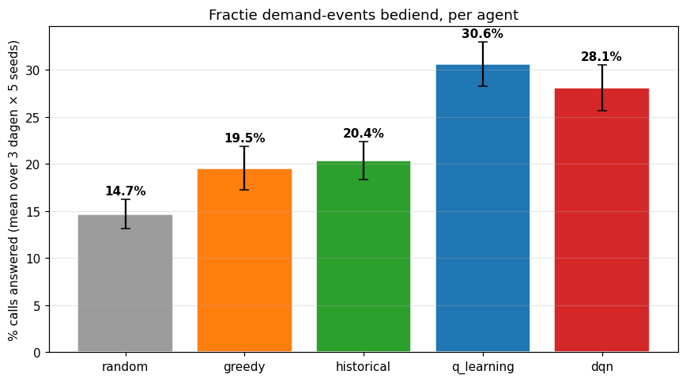
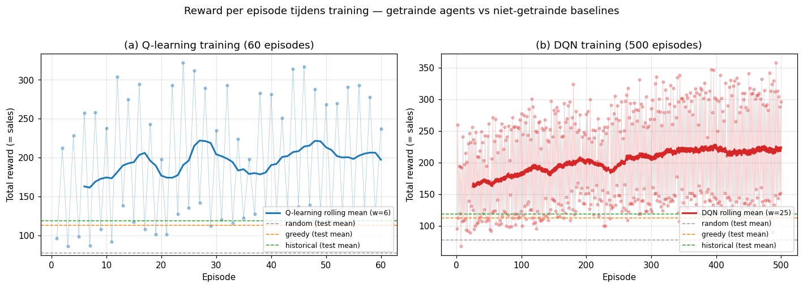

# Advanced-AI-Project — Foubert IJs dispatcher

## Project overview

End-to-end systeem dat ijswagen-dispatching optimaliseert voor [Foubert IJs](https://www.foubert.eu): een **demand forecaster** voorspelt vraag per (zone, uur), een **Gym-compatibele simulator** speelt een hele dag af, en **RL-agents** leren waar elke kar best naartoe rijdt. Vergelijkt vijf agents (random, greedy, historical replay, tabular Q-learning, DQN) op een 3-dagen export van GPS, sales en calls. Inhoudelijke focus: eerlijke evaluatie boven cijfer-maximalisatie — zie [docs/limitations.md](docs/limitations.md) voor wat het systeem niet doet en waarom.

## Setup

**Python 3.12** (getest), Windows of Linux.

```bash
git clone <repo-url>
cd Advanced-AI-Project
pip install -r requirements.txt
```

**Windows-specifiek**: `torch` import moet vóór `pandas` gebeuren omwille van een vendored-MKL-conflict bij sommige installaties. Alle modules in deze repo importeren torch als eerste regel; voor eigen scripts hou dezelfde volgorde aan. Daarnaast: train- en eval-commando's die torch gebruiken (Transformer, DQN, evaluation script) draaien betrouwbaarder via **PowerShell** dan via Git Bash door verschillen in DLL-search-paths.

```powershell
# in PowerShell:
python -m src.models.transformer_forecast
```

## Data

De ruwe data staat **al in de repo** onder `data/raw/foubertai_export/` (bewuste keuze, zie issue 11 in PROGRESS.md). Dat is een export van Foubert IJs productiedatabase, 3 dagen — 30 april (donderdag), 1 mei (vrijdag, Dag van de Arbeid) en 2 mei 2026 (zaterdag) — met:

- 7 tabellen per dag: shifts, sales, sale_orders, menu_items, reservations, calls, vans
- GPS-tracking per kar (~5s sampling)

In totaal ~697k rijen. Voor schema en datamodel-uitleg zie `data/raw/foubertai_export/2026-05-02_README_full.md`.

Verwerkte tussenresultaten komen in `data/processed/` (events, stops, zones, context, features). Modellen in `models/`. Eval-output in `results/`. Figuren in `reports/figures/`.

## Usage

De pipeline heeft een natuurlijke volgorde van data → forecast → simulator → agents → eval. Elk module-script kan los gerund worden.

### 1. Data + features prepareren

```bash
python -m src.data.load            # data/processed/events.parquet
python -m src.zones                # data/processed/stops.parquet + zones.geojson
python -m src.context              # data/processed/context.parquet  (Open-Meteo API call)
python -m src.features.build_features  # data/processed/features.parquet
```

### 2. Forecaster trainen

```powershell
python -m src.models.xgb_forecast        # models/xgb_v1.pkl  (Optuna, ~3 min)
python -m src.models.transformer_forecast # models/transformer_v1.pt (~3 min CPU)
```

### 3. Agents trainen

```powershell
python -m src.agents.q_learning   # models/q_table.pkl   (~3 min)
python -m src.agents.dqn           # models/dqn_v1.pt    (~12 min CPU)
```

### 4. Evaluatie

```powershell
python scripts/run_evaluation.py   # results/eval_summary.csv (5 agents x 3 dagen x 5 seeds, ~2 min)
```

Notebooks voor exploratie en analyse staan in `notebooks/` (EDA, sim-validatie, agent-comparison, result-viz, …) en kunnen via `jupyter nbconvert --to notebook --execute notebooks/<naam>.ipynb` end-to-end uitgevoerd worden.

## Results

**Agent ranking** ([results/eval_summary.csv](results/eval_summary.csv), mean over 3 dagen × 5 seeds):

| Agent                        | % calls answered | Revenue (€) | Distance (km) | Response (min) | Neglected zones |
| ---------------------------- | ---------------: | ----------: | ------------: | -------------: | --------------: |
| **q_learning**               |         **30.6** |   **2.765** |         1.947 |             57 |       **1.9 %** |
| dqn                          |             28.1 |       2.603 |         3.703 |             78 |           3.6 % |
| historical (echte trajecten) |             20.4 |       1.659 |         4.766 |            122 |           9.0 % |
| greedy (nearest free van)    |             19.5 |       1.575 |     **1.121** |         **22** |           2.3 % |
| random                       |             14.7 |       1.085 |        12.677 |            149 |          22.1 % |

Tabular Q-learning leidt op revenue, % answered én neglected-zones; greedy is sneller in response-time maar haalt minder totale revenue (chase-vs-pool trade-off). Detail-analyse in [notebooks/05_agent_comparison.ipynb](notebooks/05_agent_comparison.ipynb).

**Forecast vs. agent contributie**: een ablation toonde dat DQN met **oracle ground-truth forecast** ~3× zoveel sales realiseert als met de geleerde Transformer — forecast-kwaliteit is de dominante hefboom, niet agent-architectuur.

### Hero figures





## Repo structure

```
.
├── data/
│   ├── raw/foubertai_export/   # 3-dagen productie-export (in git)
│   └── processed/              # afgeleide parquet/geojson
├── notebooks/                  # 01_eda, 02_forecast, 03_simulation,
│                               # 04_agents, 05_results
├── app/                        # Streamlit demo app
│   ├── streamlit_app.py        # entrypoint
│   ├── sidebar.py              # gedeelde sidebar + Foubert-CSS
│   └── pages/                  # 1_Forecast, 2_Dispatch, 3_Comparison
├── src/
│   ├── data/load.py            # 7 tabellen + GPS, build master events
│   ├── zones.py                # DBSCAN stops + H3 zones
│   ├── context.py              # Open-Meteo weer + Belgische feestdagen
│   ├── features/build_features.py  # 65k rijen × 17 features met lag/rolling
│   ├── models/
│   │   ├── xgb_forecast.py     # Optuna-getunede XGBoost + SHAP
│   │   └── transformer_forecast.py # 2-layer Transformer met attention export
│   ├── env/
│   │   ├── dispatcher_env.py   # Gymnasium env, 911 zones × 15 vans
│   │   ├── forecast_service.py # Transformer als black-box service
│   │   └── replay.py           # GPS/stops-based action builder
│   ├── agents/
│   │   ├── random_agent.py / greedy_agent.py / historical_agent.py
│   │   ├── q_learning.py       # tabular Q over 4 macro-options
│   │   └── dqn.py              # PyTorch Q-net + target net + replay
│   └── eval/metrics.py         # 6 metric-functies + evaluate_episode wrapper
├── scripts/run_evaluation.py   # one-command evaluation pipeline
├── models/                     # gepickled artifacts (xgb, transformer, q_table, dqn)
├── reports/figures/            # alle gegenereerde plots
├── results/eval_summary.csv    # agent x dag x seed evaluation
├── docs/
│   ├── mdp_spec.md             # state/action/reward design (issue 3.2)
│   └── limitations.md          # honest limitations + future work
├── PROGRESS.md                 # per-issue progress log
├── requirements.txt
├── Makefile                    # install / all / clean targets
├── LICENSE
└── README.md
```

## Demo app

Interactieve Streamlit-app met vier tabs (Forecast / Dispatch / Comparison / About) en een gedeelde sidebar voor globale parameters (dag-type, temperatuur, neerslag, aantal beschikbare karren).

### Lokaal draaien (defense-default)

```bash
streamlit run app/streamlit_app.py
# of als streamlit niet op je PATH staat:
python -m streamlit run app/streamlit_app.py
```

De app opent op `http://localhost:8501`. De sidebar-parameters blijven bewaard tussen de tabs via `st.session_state`. Theme + Foubert-zalmrood accent worden ingelezen uit [.streamlit/config.toml](.streamlit/config.toml).

### Streamlit Community Cloud (optioneel)

Voor een publieke URL (zonder lokale install) kan de app op [Streamlit Community Cloud](https://streamlit.io/cloud) gedeployed worden:

1. Fork/push de repo naar GitHub.
2. Op `share.streamlit.io` → **New app** → kies de repo + branch + main file `app/streamlit_app.py`.
3. Geen extra secrets nodig — alle data en modellen zitten al in de repo.

Streamlit Cloud installeert `requirements.txt` automatisch. Cold-start is ~30 sec (PyTorch + XGBoost laden); daarna instant via de cache_resource decorators. Bij memory-warnings: PyTorch-import en DQN-laad zijn de zwaarste posten — eventueel CUDA-builds vervangen door cpu-only `torch` in een aparte `requirements-cloud.txt`.

### Defense-checklist

- Lokaal getest op Windows (Python 3.12) en Linux.
- Cold-start van elke tab onder ~10 sec dankzij `@st.cache_resource` voor modellen + forecaster.
- Error-handling: bij ontbrekende modellen toont elke tab welk train-commando het ontbrekende artefact aanmaakt (zie [app/sidebar.py — `require_files`](app/sidebar.py)).
- Help-tooltips bij elke sidebar-parameter; About-tab voor projectcontext + links.

## Limitations

Eerlijke inventaris van wat dit project niet doet (3-dagen-beperking, simulator-aannames, reward-tuning, overfitting-risico) inclusief mitigaties en concrete future work: zie [docs/limitations.md](docs/limitations.md). Synthese: forecast-kwaliteit is de grootste hefboom voor verdere verbetering, niet agent-architectuur.
